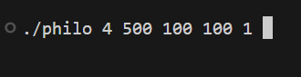
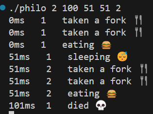
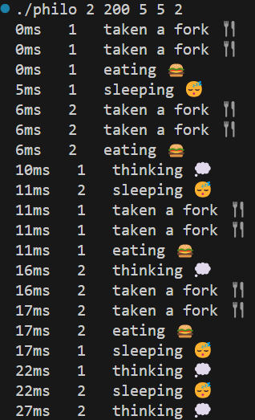

# Philosophers (42 Firenze)

## Introduction

# [Subject](./Docks/subject/philosophers.subject.pdf)

This project involves working with pthread_mutex_t, presenting you with the challenge of the  philosophers.
Each philosopher has a fork, and each philosopher has an itinerary.

- Eating
- Sleeping
- Think
- Time of death

The stack is composed of 5 values :

- number_of_philosophers
- time_to_die (in milliseconds)
- time_to_eat (in milliseconds)
- time_to_sleep (in milliseconds)
- number_of_times_each_philosopher_must_eat (optional argument)



If the philosopher doesn't eat in time, and the time of death has passed since the last time they ate, then the philosopher dies.
Also consider that the philosopher needs two forks to eat therefore, if the eating time or sleeping time exceeds the time of death, the philosopher dies.



## Testing

### Enter the folder where the Makefile is located and open the terminal.

``` bash
make
./philo 2 200 50 50 2 
```

